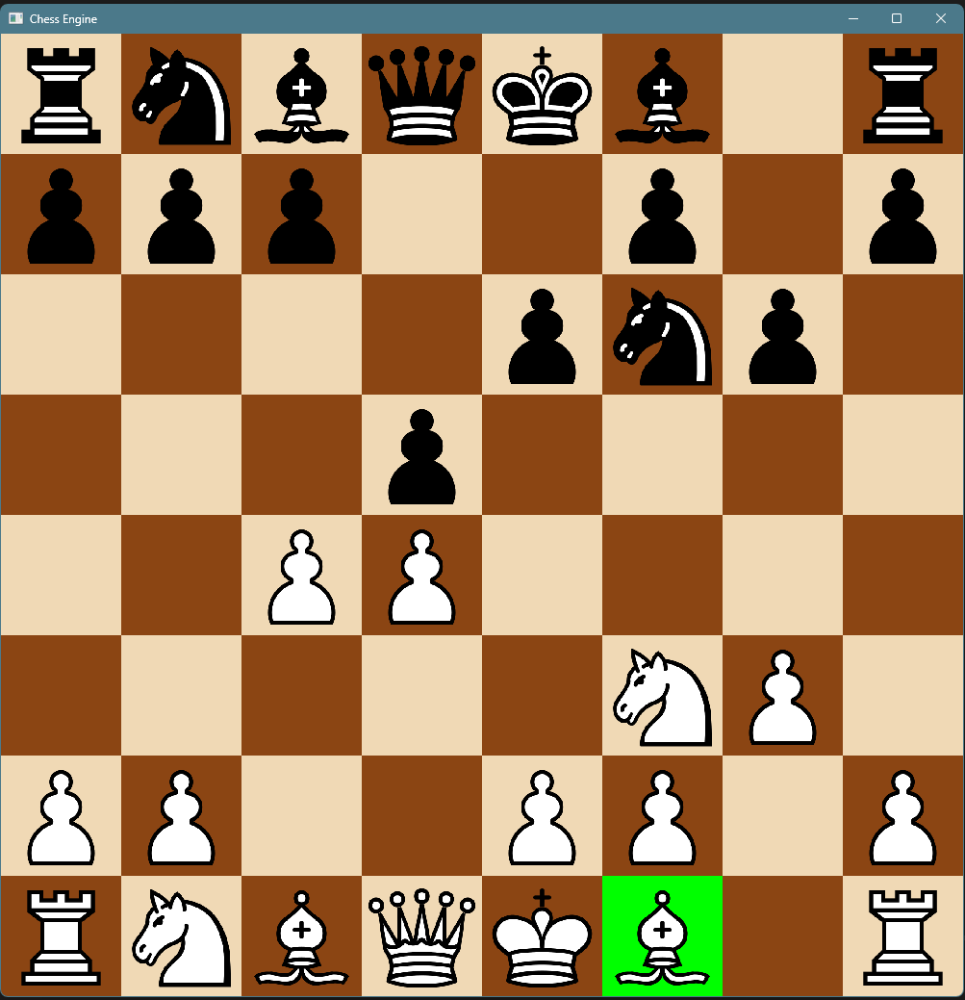

# C++ Chess Engine

An ongoing chess application and engine project written from scratch in C++ using SFML.

## Current Progress

- CMake-based C++ project setup
- Graphical chess board rendered using SFML
- Mouse-based board-square selection
- Object-oriented board and piece representation
- Initial chess position generation
- Separation of interface and implementation using header/source files
- Further separation of implementation into core and engine required parts
- Alpha-beta pruning Minimax algorithm implemented as a search function for the engine
- Engine linked to GUI so you can now play against it

## Further Development Goals

future areas of investigation may include:

- Move ordering
- Transposition Tables
- Iterative Deepening
- Quiescence Search
- Improving positional evaluation (trivial sum rn)
- Piece-square tables
- More efficient board representations
- Search and move-generation benchmarking
- Further performance optimisation

## Technologies

- C++
- SFML
- CMake
- Git / GitHub

## Building the project

### Requirements

- C++17-compatible compiler
- CMake 3.25 or newer
- SFML 3

### Build

Clone the repository using:

    git clone https://github.com/Sh0cKz3/cpp-chess-engine.git
    cd cpp-chess-engine

Configure and build using CMake commands in terminal:

    cmake --preset default
    cmake --build build

Then run using the executable by standard command:

    ./build/ChessEngine.exe

## Status

The core chess rules (excluding 3-fold-repetition which I haven't figured out efficiently yet) and a functional search engine are currently implemented.

Continuing to develop the engine, focusing on the algorithm and search side for perfomance optimisations rather than looking to improve the UI, and may consider refactoring to improve the data-structure from the intuitive (which made this easier to build) 2D-array to bitboards which are many times more effective.